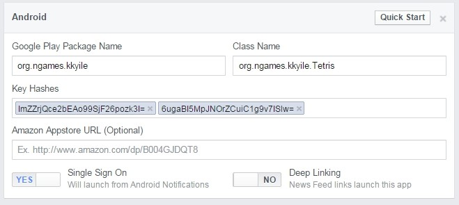
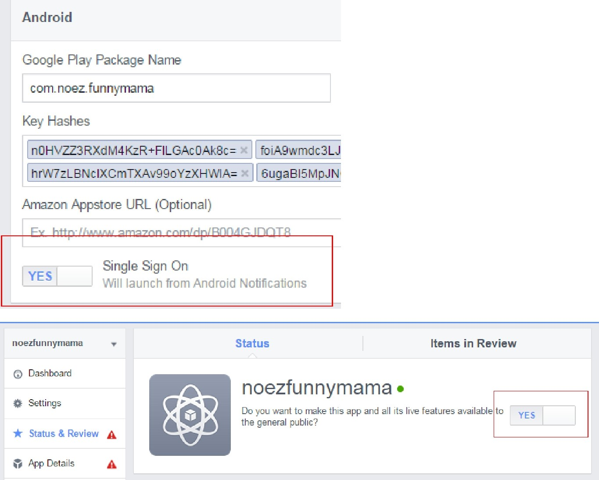
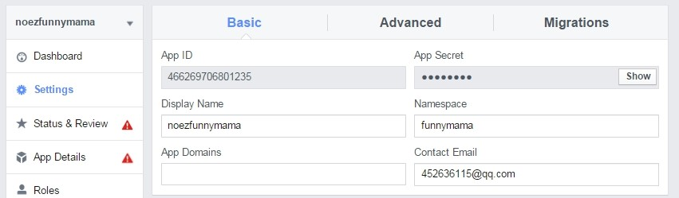

# 常见问题

## 打包相关

### 问题1

> ####  问题描述

 如果在安装打包好的游戏包时候安装不上去或控制台提示以下提示：

```java
[2015-04-08 11:11:17 - Game321SDKUnityPop] Installation error:
INSTALL_FAILED_CONFLICTING_PROVIDER
[2015-04-08 11:11:17 - Game321SDKUnityPop] Please check logcat output for more
details.
[2015-04-08 11:11:17 - Game321SDKUnityPop] Launch canceled!
```

> #### **造成原因**

手机设备中存在相同配置的 provider

> #### 解决方案

请查看你的 provider 是否配置正确，尤其是{facebook\_app\_id}这个参
数是否配置正确，避免与其它的 APK 冲突。


## Facebook相关

###  登录问题1

> ####  问题描述

 打开 Facebook 登录（存在 Facebook 客户端），之后马上关闭回到打开之前
的状态

> #### **造成原因**

 网络问题

> #### 解决方案

 检查网络是否可以正常打开 Facebook 主页


###  登录问题2

> ####  问题描述

打开 Facebook 登录（存在 Facebook 客户端），登录 Facebook 帐号，之后马
上关闭回到登录之前的界面

> #### **造成原因**

 Facebook 控制台配置的 [Android KeyHash](https://developers.facebook.com/docs/android/getting-started#create_hash) 不正确

> #### 解决方案

 检查 Facebook 控制台配置的 Android  KeyHash 与打包游戏时候所用
证书的 KeyHash 是否匹配。




### 登录类问题

> ####  问题描述

出现上述以外 Facebook 登录失败的相关问题，可以采用以下解决方案

> #### 解决方案

检查 Facebook 控制台的 AppId 和 DisplayName 是否和本地配置的一
致。并且 Facebook 控制台是否打开登录的相关配置。




以上 2 者是否是开启（YES）状态


### 

### 分享类问题

> ####  问题描述

出现 Facebook 分享失败的相关问题，可以采用以下解决方案

> #### 解决方案

 检查 Facebook 控制台的 AppId 和 DisplayName 是否和本地配置的一
致。


在 `res/values` 中配置`string.xml`， 查看 :

```java
<!--Facebook的应用ID-->
<string name="facebook_app_id">facebook_app_id</string>
<!--Facebook的应用名称 -->
<string name="facebook_app_name">app_name</string>
```

对应控制台




2 者配置的必须一致。



### 

