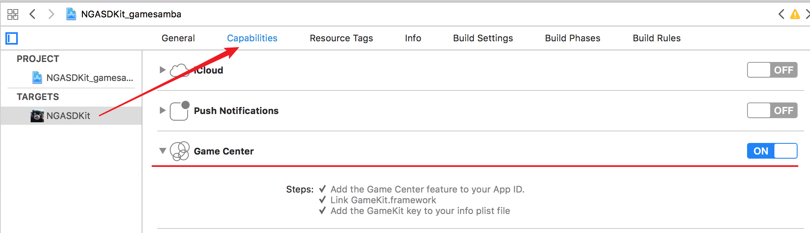
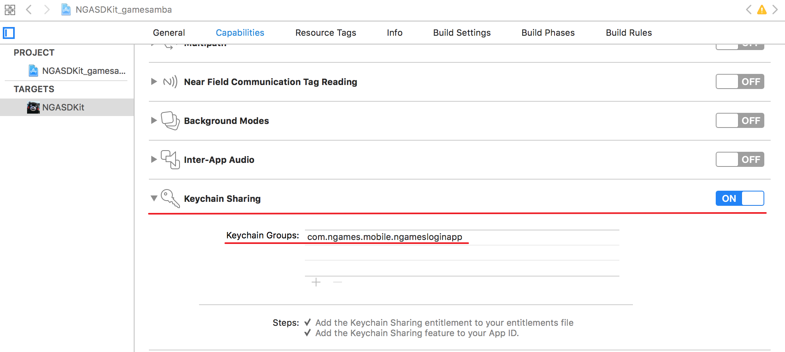
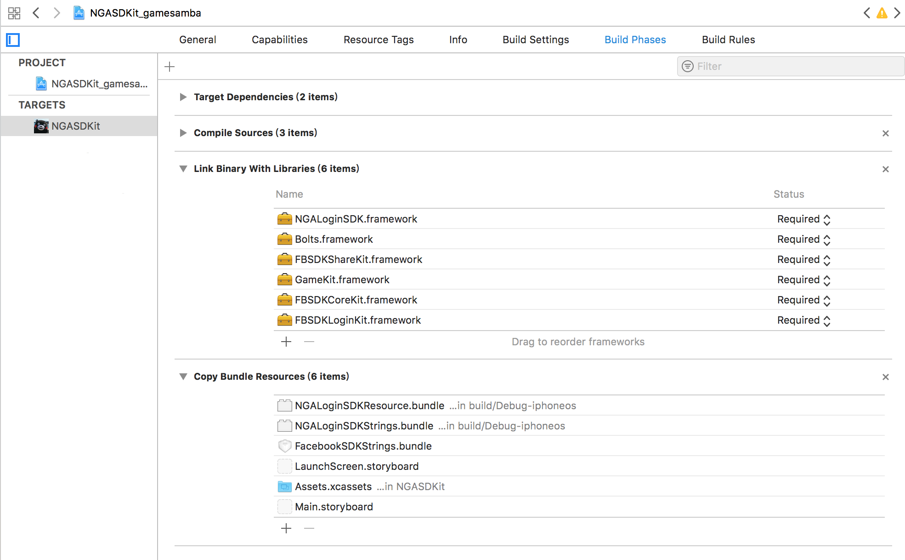
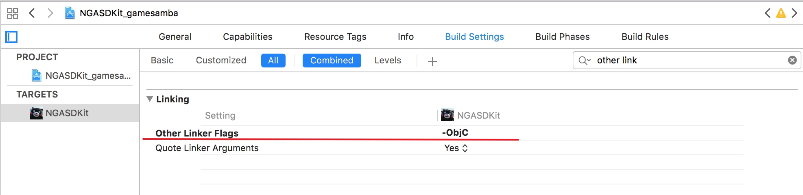

# SDK集成步骤

## 1. 在Xcode工程中开启特性支持

开启GameCenter支持, 如果开启失败, 请检查在`iTunes connect`中, app是否开启了GameCenter支持

开启Keychain支持, 注意, 请正确填入包名到Keychain Groups中

## 2. 在Build Phases中添加相关文件, 所需文件如下\(在Demo中获取相关文件\):

> ~~Bolts.framework~~ \(Facebook SDK V5 已弃用\)
>
> FBSDKCoreKit.framework
>
> FBSDKLoginKit.framework
>
> FBSDKShareKit.framework
>
> NGALoginSDK.framework
>
> FacebookSDKStrings.bundle
>
> NGALoginSDKResource.bundle
>
> NGALoginSDKStrings.bundle
>
> GameKit.framework \(系统库\)

然后将文件添加到`Build Phases`中如下图:

framework添加到 `Link Binary With Libraries` 中, bundle资源文件添加到 `Copy Bundle Resources`中:

## 3. 需要关注的Build Settings设置:

注意拼写为: **-ObjC**

### 至此, SDK文件集成完毕

