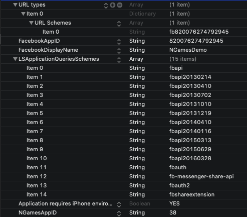

# SDK配置及初始化

## 1. Info.plist文件配置

必要配置项如红框所示:



源文件部分代码如下, **使用时需要配置相应的facebook appid和 NGamesAppid**即可

```markup
	<key>CFBundleURLTypes</key>
	<array>
		<dict>
			<key>CFBundleURLSchemes</key>
			<array>
				<string>fb820076274792945</string>
			</array>
		</dict>
	</array>
	<key>FacebookAppID</key>
	<string>820076274792945</string>
	<key>FacebookDisplayName</key>
	<string>NGamesDemo</string>
	<key>LSApplicationQueriesSchemes</key>
	<array>
		<string>fbapi</string>
		<string>fbapi20130214</string>
		<string>fbapi20130410</string>
		<string>fbapi20130702</string>
		<string>fbapi20131010</string>
		<string>fbapi20131219</string>
		<string>fbapi20140410</string>
		<string>fbapi20140116</string>
		<string>fbapi20150313</string>
		<string>fbapi20150629</string>
		<string>fbapi20160328</string>
		<string>fbauth</string>
		<string>fb-messenger-share-api</string>
		<string>fbauth2</string>
		<string>fbshareextension</string>
	</array>
	<key>LSRequiresIPhoneOS</key>
	<true/>
	<key>NGamesAppID</key>
	<string>38</string>
```

## 2. 在AppDelegate文件中配置初始化代码

### 导入头文件 `#import <NGALoginSDK/NGALoginSDK.h>`

在`- (BOOL)application:(UIApplication *)application didFinishLaunchingWithOptions:(NSDictionary *)launchOptions` 方法中配置如下代码:

```objectivec
//配置语言
[NGAGameLoginKit shareInstance].languageCode = @"en";
//配置FB和GameCenter等的初始化
[[NGAGameLoginKit shareInstance] setupGameHandlerWithApplication:application LaunchingWithOptions:launchOptions];
```

> 语言项可配置为:
>
> | languageCode | description |
> | :--- | :--- |
> | en | 英文, 如非中文地区, 请配置 @"en" |
> | zh-Hant | 简体中文 |
> | zh-Hans | 繁体中文 |
> | fr | 法语 |
> | th | 泰语 |
> | ja | 日语 |
> | ko | 韩语 |
> | id | 印尼语 |

### 并配置相应的OpenURL方法:

```objectivec
///iOS 9 之前使用的方法
- (BOOL)application:(UIApplication *)application openURL:(NSURL *)url sourceApplication:(NSString *)sourceApplication annotation:(id)annotation {
    //FB的OpenURL方法
    [[NGAGameLoginKit shareInstance] application:application openURL:url sourceApplication:sourceApplication annotation:annotation];
    return YES;
}

/** iOS 9 建议此新方法 */
- (BOOL)application:(UIApplication *)app openURL:(NSURL *)url options:(NSDictionary<UIApplicationOpenURLOptionsKey,id> *)options{
    //FB的OpenURL方法
    [[NGAGameLoginKit shareInstance] application:app openURL:url options:options];
    return YES;
}
```

### 至此, SDK初始化完毕

