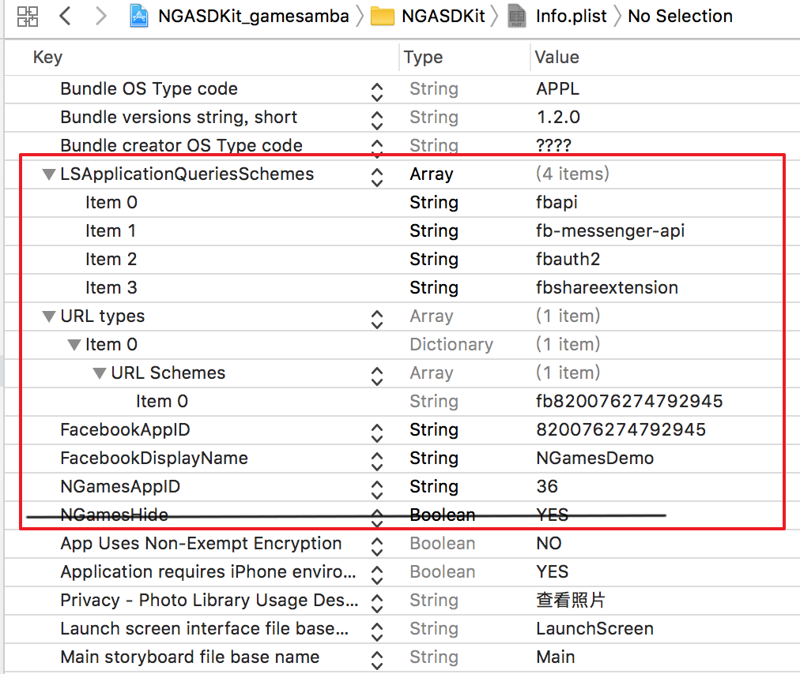

# SDK配置及初始化

## 1. Info.plist文件配置

必要配置项如红框所示:



源文件部分代码如下, 使用时需要配置相应的facebook appid和 NGamesAppid即可

```markup
<key>LSApplicationQueriesSchemes</key>
<array>
    <string>fbapi</string>
    <string>fb-messenger-api</string>
    <string>fbauth2</string>
    <string>fbshareextension</string>
</array>
<key>CFBundleURLTypes</key>
<array>
    <dict>
        <key>CFBundleURLSchemes</key>
        <array>
            <string>fb820076274792945</string>
        </array>
    </dict>
</array>
<key>CFBundleVersion</key>
<string>1.0</string>
<key>FacebookAppID</key>
<string>820076274792945</string>
<key>FacebookDisplayName</key>
<string>NGamesDemo</string>
<key>NGamesAppID</key>
<string>36</string>
<key>NGamesHide</key>
<true/>
```

## 2. 在AppDelegate文件中配置初始化代码

### 导入头文件 `#import <NGALoginSDK/NGALoginSDK.h>`

在`- (BOOL)application:(UIApplication *)application didFinishLaunchingWithOptions:(NSDictionary *)launchOptions` 方法中配置如下代码:

```objectivec
[NGAGameLoginKit shareInstance].languageCode = @"en";
[[NGAGameLoginKit shareInstance] setupGameHandlerWithApplication:application LaunchingWithOptions:launchOptions];
```

> 语言项可配置为:
>
> | languageCode | description |
> | :--- | :--- |
> | en | 英文, 如非中文地区, 请配置 @"en" |
> | zh-Hant | 简体中文 |
> | zh-Hans | 繁体中文 |
> | fr | 法语 |
> | th | 泰语 |
> | ja | 日语 |
> | ko | 韩语 |
> | id | 印尼语 |

### 并配置相应的OpenURL方法:

```objectivec
///iOS 9 之前使用的方法
- (BOOL)application:(UIApplication *)application openURL:(NSURL *)url sourceApplication:(NSString *)sourceApplication annotation:(id)annotation {
    //FB的OpenURL方法
    BOOL handled = [[NGAGameLoginKit shareInstance] application:application openURL:url sourceApplication:sourceApplication annotation:annotation];
    return handled;
}

/** iOS 9 建议此新方法 */
- (BOOL)application:(UIApplication *)app openURL:(NSURL *)url options:(NSDictionary<UIApplicationOpenURLOptionsKey,id> *)options{
    //FB的OpenURL方法
    BOOL handled = [[NGAGameLoginKit shareInstance] application:app openURL:url options:options];
    return handled;
}
```

### 至此, SDK初始化完毕

