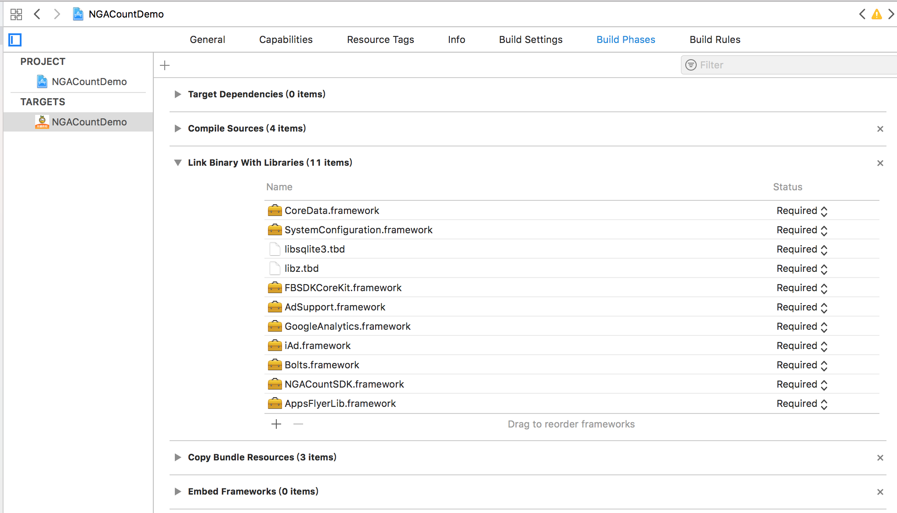

# SDK集成

如下图所示, 添加相应的库文件

包括

> NGACountSDK.framework
>
> AdSupport.framework
>
> iAd.framework
>
> SystemConfiguration.framework
>
> AppsFlyerLib.framework
>
> Bolts.framework
>
> FBSDKCoreKit.framework
>
> FirebaseAnalytics.framework
>
> FirebaseCore.framework
>
> FirebaseCoreDiagnostics.framework
>
> FirebaseInstanceID.framework
>
> GoogleUtilities.framework
>
> GoogleAppMeasurement.framework
>
> MeasurementNanoPB.framework
>
> nanopb.framework

### 并在Build Settings设置如下参数:

注意拼写为:  **-ObjC**