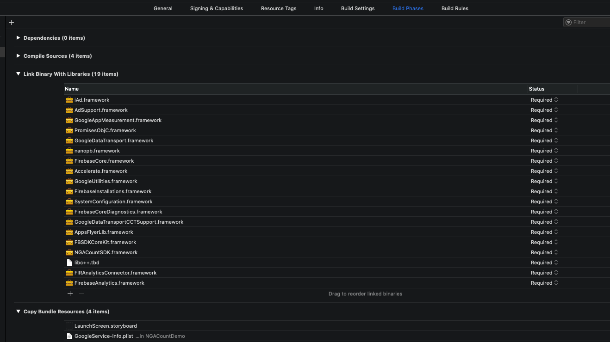

# SDK集成

如下图所示, 添加相应的库文件

包括

> NGACountSDK.framework
>
> AdSupport.framework \(系统库\)
>
> iAd.framework \(系统库\)
>
> SystemConfiguration.framework \(系统库\)
>
> Accelerate.framework \(系统库\)
>
> libc++.tbd \(系统库\)
>
> AppsFlyerLib.framework
>
> FBSDKCoreKit.framework \(登录SDK同样也包含\)
>
> FIRAnalyticsConnector.framework
>
> FirebaseAnalytics.framework
>
> FirebaseCore.framework
>
> FirebaseCoreDiagnostics.framework
>
> FirebaseInstallations.framework
>
> GoogleAppMeasurement.framework
>
> GoogleDataTransport.framework
>
> GoogleDataTransportCCTSupport.framework
>
> GoogleUtilities.framework
>
> PromisesObjC.framework
>
> nanopb.framework

## 并在Build Settings设置如下参数:

注意拼写为: **-ObjC**

