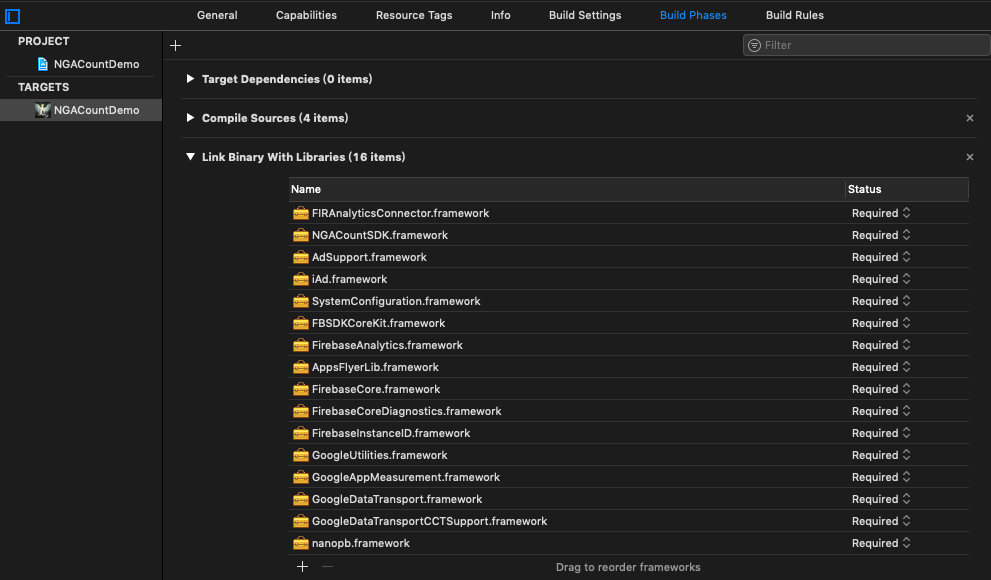

# SDK文件集成

如下图所示, 添加相应的库文件

包括

> NGACountSDK.framework
>
> AdSupport.framework (系统库)
>
> iAd.framework (系统库)
>
> SystemConfiguration.framework (系统库)
>
> AppsFlyerLib.framework
>
> ~~Bolts.framework~~ (Facebook SDK V5 已弃用)
>
> FBSDKCoreKit.framework (登录SDK同样也包含)
>
> FirebaseAnalytics.framework
>
> FirebaseCore.framework
>
> FirebaseCoreDiagnostics.framework
>
> FirebaseInstanceID.framework
>
> GoogleUtilities.framework
>
> GoogleAppMeasurement.framework
>
> MeasurementNanoPB.framework
>
> nanopb.framework

## 并在Build Settings设置如下参数:

注意拼写为: **-ObjC**

