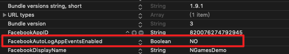

# 事件调用

一般情况下事件调用方法为:

```objectivec
[NGAAppEvents.sharedInstance recordEvent:@"TestEventA"];
[NGAAppEvents.sharedInstance recordEvent:@"TestEventC" values:@{@"level" : @"10"}];
```

Google Firebase的事件调用方法接口为:

```objectivec
- (void)gaLogEventWithName:(NSString *)name parameters:(NSDictionary<NSString *, id> *)parameters;
```

根据需求确认是否调用Google Firebase的事件记录.

## Purchase事件单独调用 （不会传送至Firebase）

```objectivec
/**
 记录购买事件

 @param contentID 物品ID
 @param contentType 物品类型
 @param product iOS 商品对象
 @param trans iOS 交易对象
 @param serverID 服务器ID
 */
- (void)recordPurchaseEventWithContentID:(NSString *)contentID contentType:(NSString *)contentType product:(SKProduct *)product transaction:(SKPaymentTransaction *)trans serverID:(NSString *)serverID;

/**
 记录购买事件

 @param contentID 物品ID
 @param contentType 物品类型
 @param revenue 金额
 @param currency 货币单位  例如 @"USD", @"HKD", @"CNY", @"TWD" 等等, 更多请参考 https://www.xe.com/iso4217.php
 @param serverID 服务器ID
 */
- (void)recordPurchaseEventWithContentID:(NSString *)contentID contentType:(NSString *)contentType revenue:(double)revenue currency:(NSString *)currency serverID:(NSString *)serverID DEPRECATED_MSG_ATTRIBUTE("Use - recordPurchaseEventWithContentID: contentType: product: transaction: serverID: instead");
```

Example:

```objectivec
 [NGAAppEvents.sharedInstance recordPurchaseEventWithContentID:item.contentID
                                                   contentType:@"金币" product:product
                                                   transaction:transaction
                                                      serverID:self.serverID];
```


## 配置 手动记录Facebook的购买事件

FBSDK会自动记录游戏的内购事件, 如需禁用并改为手动记录的话, 需要在info.plist文件中添加相关的字典项 **FacebookAutoLogAppEventsEnabled** 并设置这个Boolean值为 **NO**, 如下图所示


