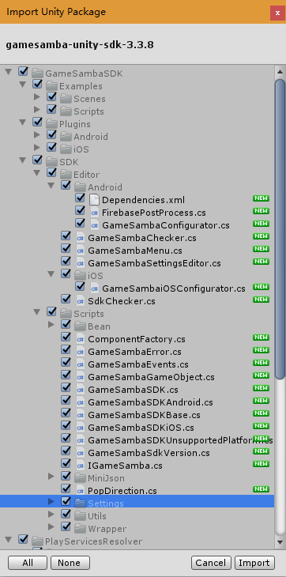
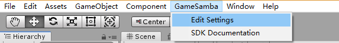
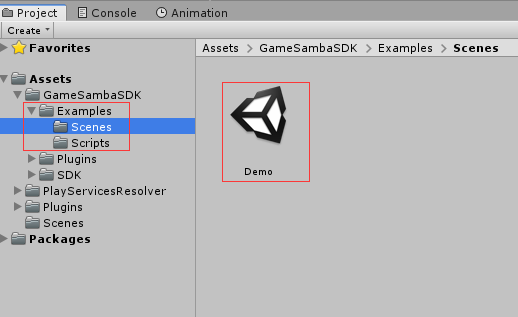
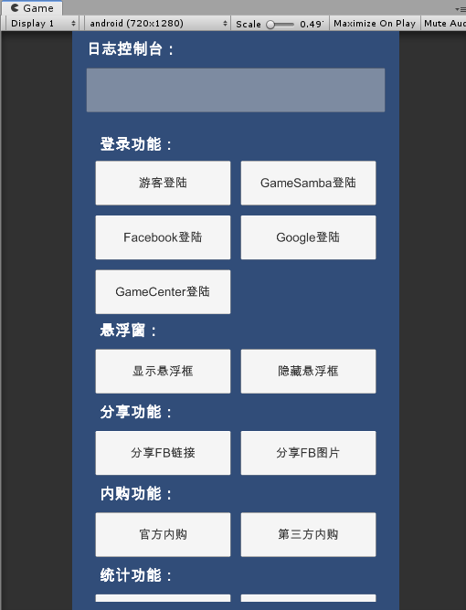

# 准备开始

## 将SDK添加到Unity项目中

### 1.导入SDK

在 Unity菜单选择  `Assets` &gt; `Import Package` &gt; `Custom Package`

选择SDK文件，导入最新版本的SDK：`gamesamba-unity-sdk-3.3.8.unitypackage` 

点击Import，导入全部资源。

### 2.设置SDK配置文件

在Unity菜单选择   `GameSamba` &gt; `Edit Settings`

Inspector 中将显示 “GameSambaSettings”。配置相关参数（由我们产品提供）。

配置完成，保存，并且点击Apply按钮，会自动生成对应平台（Android）的配置文件。

### 3.查看DEMO

Demo文件在中Assets &gt; GameSambaSDK - Examples中，可以通过Demo查看方法使用。

### 4.导入Firebase配置文件

将产品给过来的配置文件

1.google-services.json

将该文件放到 Assets &gt; Plugins &gt; Android 文件的根目录中

2.GoogleService-Info.plist

将该文件放到 Assets &gt; Plugins &gt; iOS 文件的根目录中

### 5.配置对应平台的相关配置

* [Android](android.md)
* [iOS](ios.md)

