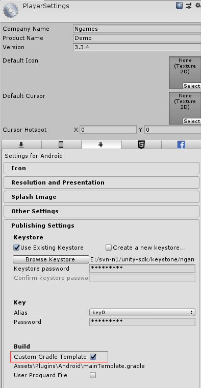
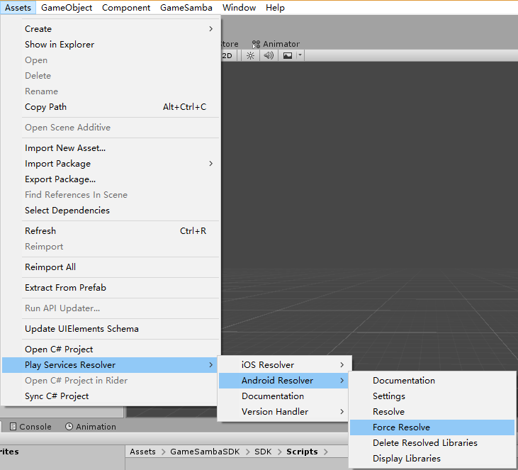
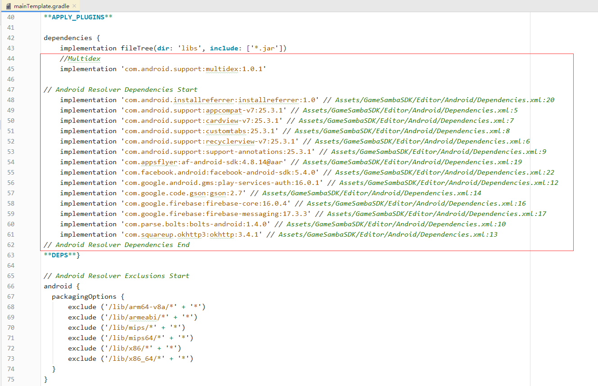
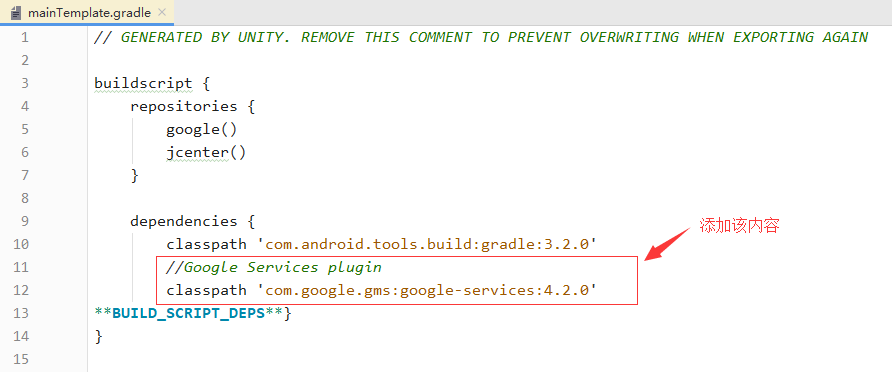
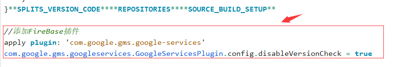

# Android

Android这边使用了gradle去构建相关依赖架包。

### 设置开启gradle

在 `PlayerSettings` &gt; `Publishing Settings` &gt; `Build`

勾选 `Custom Gradle Template` ，会自动生成  `Assets\Plugins\Android\mainTemplate.gradle` 文件



### 

### 更新依赖文件配置

SDK使用到Unity的 **`Play Services Resolver`** 插件（[链接](https://github.com/googlesamples/unity-jar-resolver)）:


> 插件描述

该插件可以用于构建Android（通过gradle）和iOS（通过CocoaPods）的依赖架包。

> 最新版下载地址

（1）[链接](https://github.com/googlesamples/unity-jar-resolver/releases/tag/v1.2.124)

（2）[下载链接](https://github.com/googlesamples/unity-jar-resolver/raw/v1.2.124/play-services-resolver-1.2.124.0.unitypackage)

> 使用描述

AndroidAndroid Resolver 会自动运行，并利用 gradle 将 Android 依赖项放入 Assets/Plugins/Android 中。

* 要手动运行该解析器，请执行以下操作：依次转到 Assets &gt; Play Services Resolver &gt; Android Resolver &gt; Resolve
* 要启用或停用自动解析（默认情况下处于启用状态），请执行以下操作：依次转到 Assets &gt; Play Services Resolver &gt; Android Resolver &gt; Settings


该插件 在导入GameSamba SDK的时候，会自动导入，如果你的项目中已经使用了该插件，你可以在导入的时候勾选为不导入状态。

使用该插件更新gradle依赖：

`Assets` &gt; `Play Services Resolver` &gt; `Android Resolver` &gt; `Force Resolve`



之后可以查看`Assets\Plugins\Android\mainTemplate.gradle` ，可以发现依赖已经自动被构建进去：




### 添加Firebase配置

添加Firebase配置，用于自动构建生成firebase配置文件

在`Assets\Plugins\Android\mainTemplate.gradle` 文件中添加：



> 配置

```groovy
dependencies {
        .....
        //Google Services plugin
        classpath 'com.google.gms:google-services:4.2.0'
        .....
}
```

在该文件底部添加：



> 配置

```groovy
//添加FireBase插件
apply plugin: 'com.google.gms.google-services'
com.google.gms.googleservices.GoogleServicesPlugin.config.disableVersionCheck = true
```


